# 📊 MODELO CONCEITUAL (ER) - SIGEPOLI

## Sistema Integrado de Gestão Acadêmica, Administrativa e Operacional

---

## 1. 📝 DESCRIÇÃO DO MODELO CONCEITUAL

### 1.1 **VISÃO GERAL**
O modelo conceitual do SIGEPOLI representa a integração de quatro áreas principais:
- **Acadêmica**: Gestão de cursos, disciplinas, turmas, alunos, professores e avaliações
- **Administrativa**: Gestão de pessoas, departamentos, cargos, orçamentos e processos internos
- **Operacional**: Gestão de empresas terceirizadas, contratos, SLAs, serviços e pagamentos
- **Transversal**: Biblioteca, notificações e auditoria

### 1.2 **ENTIDADES PRINCIPAIS**

#### **CENTRAIS E ADMINISTRATIVAS**
- **users** (usuários do sistema)
- **user_roles** (tipos de papel)
- **user_role_assignments** (atribuição de papéis)
- **user_identification** (documentos)
- **user_health** (saúde)
- **departments** (departamentos)
- **department_budgets** (orçamentos)
- **staff** (funcionários)
- **academic_qualifications** (qualificações)
- **positions** (cargos)
- **staff_positions** (funções ocupadas)
- **staff_leaves** (licenças/férias)
- **evaluation** (avaliações)
- **staff_evaluation** (avaliação de funcionários)
- **course_evaluation** (avaliação de cursos)
- **performance** (resultados de avaliação)
- **course_access** (inscrição de alunos)

#### **ACADÊMICAS**
- **courses** (cursos)
- **subjects** (disciplinas)
- **course_subjects** (curso-disciplina)
- **course_availability** (oferta de vagas)
- **classes** (turmas)
- **time_slots** (horários)
- **class_schedules** (grade horária)
- **rooms** (salas)
- **resources** (recursos)
- **room_resources** (recursos por sala)
- **room_bookings** (reserva de sala)
- **students** (alunos)
- **student_enrollments** (matrícula em curso)
- **class_enrollments** (matrícula em disciplina/turma)
- **teachers** (professores)
- **teacher_specializations** (especializações)
- **teacher_availability** (disponibilidade)
- **grades** (notas)
- **assessment_types** (tipos de avaliação)
- **attendance** (presenças)
- **classes_attended** (aulas ministradas)

#### **OPERACIONAIS E FINANCEIRAS**
- **services** (serviços)
- **service_types** (categorias de serviço)
- **service_evaluation** (avaliação de serviço)
- **payments** (pagamentos)
- **payment_types** (tipos de pagamento)
- **studant_payments** (pagamento de aluno)
- **company_payments** (pagamento a empresa)
- **staff_payments** (pagamento a funcionário)
- **fines** (multas)
- **companies** (empresas)
- **companies_departments** (empresa-departamento)
- **companies_contracts** (contratos)
- **companies_sla** (SLA)
- **companies_sla_evaluation** (avaliação de SLA)

#### **SUPORTE E TRANSVERSAIS**
- **library_items** (itens da biblioteca)
- **library_loans** (empréstimos)
- **notifications** (notificações)
- **audit_logs** (auditoria)

### 1.3 **RELACIONAMENTOS PRINCIPAIS**
- **courses** → **departments** (N:1)
- **courses** → **staff** (coordenador, 1:1)
- **course_subjects** → **courses**/ **subjects** (N:1)
- **classes** → **courses** (N:1)
- **class_schedules** → **classes**, **subjects**, **teachers**, **rooms** (N:1)
- **students** → **users** (1:1)
- **student_enrollments** → **students**, **courses** (N:1)
- **class_enrollments** → **students**, **class_schedules** (N:1)
- **teachers** → **staff** (1:1)
- **teacher_specializations** → **teachers**, **subjects**, **academic_qualifications** (N:1)
- **grades** → **students**, **class_schedules**, **assessment_types** (N:1)
- **attendance** → **students**, **classes_attended** (N:1)
- **services** → **departments**, **service_types** (N:1)
- **payments** → **payment_types** (N:1)
- **studant_payments** → **payments**, **services**, **students** (N:1)
- **company_payments** → **payments**, **companies**, **department_budgets**, **staff** (N:1)
- **staff_payments** → **payments**, **staff** (N:1)
- **fines** → **payments** (N:1)
- **companies_departments** → **companies**, **departments** (N:1)
- **companies_contracts** → **companies**, **staff** (N:1)
- **companies_sla** → **companies** (N:1)
- **companies_sla_evaluation** → **companies**, **companies_sla**, **staff** (N:1)
- **library_loans** → **library_items**, **users** (N:1)
- **notifications** → **users** (N:1)
- **audit_logs** → **users** (N:1)

---

## 2. 🎨 REPRESENTAÇÃO VISUAL (MERMAID ERD)

```mermaid
erDiagram
    USERS ||--o{ STUDENTS : ""
    USERS ||--o{ STAFF : ""
    USERS ||--o{ USER_IDENTIFICATION : ""
    USERS ||--o{ USER_HEALTH : ""
    USERS ||--o{ USER_ROLE_ASSIGNMENTS : ""
    USER_ROLES ||--o{ USER_ROLE_ASSIGNMENTS : ""
    DEPARTMENTS ||--o{ COURSES : ""
    DEPARTMENTS ||--o{ DEPARTMENT_BUDGETS : ""
    DEPARTMENTS ||--o{ STAFF : ""
    DEPARTMENTS ||--o{ SERVICES : ""
    DEPARTMENTS ||--o{ ROOM_BOOKINGS : ""
    DEPARTMENTS ||--o{ COMPANIES_DEPARTMENTS : ""
    COURSES ||--o{ COURSE_SUBJECTS : ""
    COURSES ||--o{ CLASSES : ""
    COURSES ||--o{ COURSE_AVAILABILITY : ""
    COURSES ||--o{ STUDENT_ENROLLMENTS : ""
    COURSES ||--o{ CLASS_SCHEDULES : ""
    COURSES ||--o{ COURSE_EVALUATION : ""
    COURSES ||--o{ CLASS_ENROLLMENTS : ""
    STAFF ||--o{ TEACHERS : ""
    STAFF ||--o{ STAFF_POSITIONS : ""
    STAFF ||--o{ STAFF_LEAVES : ""
    STAFF ||--o{ TEACHER_AVAILABILITY : ""
    STAFF ||--o{ COMPANY_PAYMENTS : ""
    STAFF ||--o{ STAFF_PAYMENTS : ""
    STAFF ||--o{ EVALUATION : ""
    STAFF ||--o{ COMPANIES_CONTRACTS : ""
    STAFF ||--o{ COMPANIES_SLA_EVALUATION : ""
    TEACHERS ||--o{ TEACHER_SPECIALIZATIONS : ""
    TEACHERS ||--o{ TEACHER_AVAILABILITY : ""
    TEACHERS ||--o{ CLASS_SCHEDULES : ""
    SUBJECTS ||--o{ COURSE_SUBJECTS : ""
    SUBJECTS ||--o{ TEACHER_SPECIALIZATIONS : ""
    SUBJECTS ||--o{ CLASS_SCHEDULES : ""
    SUBJECTS ||--o{ GRADES : ""
    COURSE_SUBJECTS ||--o{ CLASS_SCHEDULES : ""
    CLASSES ||--o{ CLASS_SCHEDULES : ""
    CLASSES ||--o{ CLASSES_ATTENDED : ""
    CLASSES ||--o{ CLASS_ENROLLMENTS : ""
    TIME_SLOTS ||--o{ CLASS_SCHEDULES : ""
    TIME_SLOTS ||--o{ CLASSES_ATTENDED : ""
    ROOMS ||--o{ CLASS_SCHEDULES : ""
    ROOMS ||--o{ ROOM_RESOURCES : ""
    ROOMS ||--o{ ROOM_BOOKINGS : ""
    RESOURCES ||--o{ ROOM_RESOURCES : ""
    ROOM_RESOURCES ||--o{ ROOM_BOOKINGS : ""
    STUDENTS ||--o{ STUDENT_ENROLLMENTS : ""
    STUDENTS ||--o{ CLASS_ENROLLMENTS : ""
    STUDENTS ||--o{ GRADES : ""
    STUDENTS ||--o{ ATTENDANCE : ""
    STUDENT_ENROLLMENTS ||--o{ CLASS_ENROLLMENTS : ""
    CLASS_SCHEDULES ||--o{ CLASS_ENROLLMENTS : ""
    CLASS_SCHEDULES ||--o{ GRADES : ""
    CLASS_SCHEDULES ||--o{ ATTENDANCE : ""
    CLASS_SCHEDULES ||--o{ CLASSES_ATTENDED : ""
    GRADES ||--o{ ASSESSMENT_TYPES : ""
    ATTENDANCE ||--o{ CLASSES_ATTENDED : ""
    EVALUATION ||--o{ STAFF_EVALUATION : ""
    EVALUATION ||--o{ COURSE_EVALUATION : ""
    EVALUATION ||--o{ PERFORMANCE : ""
    SERVICES ||--o{ SERVICE_EVALUATION : ""
    SERVICES ||--o{ STUDANT_PAYMENTS : ""
    SERVICE_TYPES ||--o{ SERVICES : ""
    PAYMENTS ||--o{ STUDANT_PAYMENTS : ""
    PAYMENTS ||--o{ COMPANY_PAYMENTS : ""
    PAYMENTS ||--o{ STAFF_PAYMENTS : ""
    PAYMENTS ||--o{ FINES : ""
    PAYMENT_TYPES ||--o{ PAYMENTS : ""
    COMPANIES ||--o{ COMPANIES_DEPARTMENTS : ""
    COMPANIES ||--o{ COMPANIES_CONTRACTS : ""
    COMPANIES ||--o{ COMPANIES_SLA : ""
    COMPANIES ||--o{ COMPANIES_SLA_EVALUATION : ""
    COMPANIES_DEPARTMENTS ||--o{ COMPANIES_CONTRACTS : ""
    COMPANIES_CONTRACTS ||--o{ COMPANIES_SLA : ""
    COMPANIES_SLA ||--o{ COMPANIES_SLA_EVALUATION : ""
    LIBRARY_ITEMS ||--o{ LIBRARY_LOANS : ""
    USERS ||--o{ LIBRARY_LOANS : ""
    USERS ||--o{ NOTIFICATIONS : ""
    USERS ||--o{ AUDIT_LOGS : ""
```

---

## 3. 📋 LEGENDA DOS SÍMBOLOS

### **ENTIDADES**
- **Retângulo**: Representa uma entidade
- **Nome em maiúsculas**: Nome da entidade
- **Atributos listados**: Características da entidade

### **ATRIBUTOS**
- **PK**: Primary Key (Chave Primária)
- **UK**: Unique Key (Chave Única)
- **FK**: Foreign Key (Chave Estrangeira)

### **RELACIONAMENTOS**
- **||--o{**: Um para muitos (1:N)
- **}o--o{**: Muitos para muitos (N:M)
- **||--||**: Um para um (1:1)

### **TIPOS DE DADOS**
- **int**: Número inteiro
- **varchar**: Texto de tamanho variável
- **text**: Texto longo
- **decimal**: Número decimal
- **date**: Data
- **timestamp**: Data e hora
- **enum**: Lista de valores predefinidos
- **boolean**: Verdadeiro/Falso

---

## 4. 🎯 CARACTERÍSTICAS DO MODELO

### **4.1 NORMALIZAÇÃO**
- **1ª Forma Normal (1FN)**: Todos os atributos são atômicos
- **2ª Forma Normal (2FN)**: Dependências parciais eliminadas
- **3ª Forma Normal (3FN)**: Dependências transitivas eliminadas

### **4.2 INTEGRIDADE**
- **Integridade Referencial**: Foreign Keys garantem consistência
- **Integridade de Domínio**: Check constraints validam dados
- **Integridade de Entidade**: Primary Keys garantem unicidade

### **4.3 ESCALABILIDADE**
- **Single Table Inheritance**: Usuários centralizados
- **Modularidade**: Áreas bem definidas
- **Extensibilidade**: Fácil adição de novas funcionalidades

---

## 5. 📊 ESTATÍSTICAS DO MODELO

- **Total de Entidades**: 17
- **Total de Relacionamentos**: 15
- **Entidades Principais**: 3 (Usuário, Departamento, Curso)
- **Entidades Académicas**: 4 (Disciplina, Turma, Sala, Horário)
- **Entidades Administrativas**: 3 (Funcionário, Cargo, Orçamento)
- **Entidades Operacionais**: 3 (Empresa, Contrato, SLA)
- **Entidades de Suporte**: 4 (Serviço, Pagamento, Item_Biblioteca, Notificação)

---

*Modelo conceitual desenvolvido para o Sistema Integrado de Gestão Académica, Pessoal e Operacional (SIGEPOLI)* 