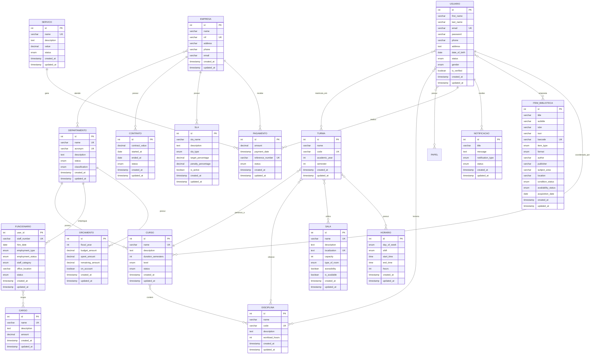

# 📊 MODELO CONCEITUAL (ER) - SIGEPOLI

## Sistema Integrado de Gestão Académica, Pessoal e Operacional para Instituto Superior Politécnico

---

## 1. 📝 DESCRIÇÃO DO MODELO CONCEITUAL

### 1.1 **VISÃO GERAL**
O modelo conceitual do SIGEPOLI representa a integração de três áreas principais:
- **Área Académica**: Gestão de cursos, disciplinas, turmas, alunos e avaliações
- **Área Administrativa**: Gestão de pessoal, departamentos e recursos humanos
- **Área Operacional**: Gestão de empresas terceirizadas, contratos e SLA

### 1.2 **ENTIDADES PRINCIPAIS**

#### **ENTIDADES CENTRAIS**
1. **USUÁRIO** - Entidade central que implementa Single Table Inheritance
   - Atributos: id, nome, email, senha, telefone, endereço, data_nascimento, status, gênero
   - Tipos: Aluno, Professor, Funcionário, Coordenador

2. **DEPARTAMENTO** - Estrutura organizacional da instituição
   - Atributos: id, nome, sigla, descrição, status, classificação
   - Responsável por: cursos, funcionários, orçamentos

3. **CURSO** - Programas académicos oferecidos
   - Atributos: id, nome, descrição, duração_semestres, nível, status
   - Relacionamentos: departamento, coordenador, disciplinas

#### **ENTIDADES ACADÉMICAS**
4. **DISCIPLINA** - Matérias do currículo
   - Atributos: id, nome, código, descrição, carga_horária

5. **TURMA** - Grupos de alunos por período
   - Atributos: id, nome, código, ano_académico, semestre

6. **SALA** - Espaços físicos para aulas
   - Atributos: id, nome, localização, capacidade, tipo, acessibilidade

7. **HORÁRIO** - Períodos de tempo para aulas
   - Atributos: id, dia_semana, turno, hora_início, hora_fim

#### **ENTIDADES ADMINISTRATIVAS**
8. **FUNCIONÁRIO** - Pessoal administrativo
   - Atributos: número_funcionário, data_contratação, tipo_emprego, categoria

9. **CARGO** - Posições hierárquicas
   - Atributos: id, nome, descrição, salário

10. **ORÇAMENTO** - Recursos financeiros por departamento
    - Atributos: id, ano_fiscal, valor_orçamento, valor_gasto

#### **ENTIDADES OPERACIONAIS**
11. **EMPRESA** - Prestadoras de serviços terceirizados
    - Atributos: id, nome, NIF, endereço, telefone, email

12. **CONTRATO** - Acordos com empresas
    - Atributos: id, valor, data_início, data_fim, status

13. **SLA** - Acordos de nível de serviço
    - Atributos: id, tipo, meta_percentual, penalidade_percentual

#### **ENTIDADES DE SUPORTE**
14. **SERVIÇO** - Serviços oferecidos (propinas, documentos)
    - Atributos: id, nome, descrição, valor, status

15. **PAGAMENTO** - Transações financeiras
    - Atributos: id, valor, data, método, status, número_referência

16. **ITEM_BIBLIOTECA** - Recursos da biblioteca
    - Atributos: id, título, autor, editora, tipo, formato, ISBN

17. **NOTIFICAÇÃO** - Comunicações do sistema
    - Atributos: id, título, mensagem, tipo, status

### 1.3 **RELACIONAMENTOS PRINCIPAIS**

#### **RELACIONAMENTOS ACADÉMICOS**
- **CURSO** → **DEPARTAMENTO** (N:1) - Cada curso pertence a um departamento
- **CURSO** → **USUÁRIO** (N:1) - Cada curso tem um coordenador
- **CURSO** → **DISCIPLINA** (N:M) - Cursos possuem múltiplas disciplinas
- **TURMA** → **CURSO** (N:1) - Cada turma pertence a um curso
- **TURMA** → **DISCIPLINA** (N:M) - Turmas possuem múltiplas disciplinas
- **USUÁRIO** → **TURMA** (N:M) - Alunos matriculam-se em turmas
- **USUÁRIO** → **DISCIPLINA** (N:M) - Professores lecionam disciplinas
- **SALA** → **TURMA** (1:N) - Salas são utilizadas por turmas
- **HORÁRIO** → **TURMA** (N:M) - Turmas possuem múltiplos horários

#### **RELACIONAMENTOS ADMINISTRATIVOS**
- **DEPARTAMENTO** → **USUÁRIO** (1:N) - Departamentos possuem funcionários
- **DEPARTAMENTO** → **ORÇAMENTO** (1:N) - Departamentos possuem orçamentos
- **USUÁRIO** → **CARGO** (N:M) - Funcionários ocupam cargos
- **USUÁRIO** → **PAPEL** (N:M) - Usuários possuem papéis no sistema

#### **RELACIONAMENTOS OPERACIONAIS**
- **EMPRESA** → **DEPARTAMENTO** (N:M) - Empresas atendem departamentos
- **EMPRESA** → **CONTRATO** (1:N) - Empresas possuem contratos
- **EMPRESA** → **SLA** (1:N) - Empresas possuem acordos de SLA
- **CONTRATO** → **PAGAMENTO** (1:N) - Contratos geram pagamentos

#### **RELACIONAMENTOS FINANCEIROS**
- **SERVIÇO** → **PAGAMENTO** (1:N) - Serviços geram pagamentos
- **USUÁRIO** → **PAGAMENTO** (1:N) - Usuários realizam pagamentos
- **EMPRESA** → **PAGAMENTO** (1:N) - Empresas recebem pagamentos

### 1.4 **ATRIBUTOS IDENTIFICADORES**
- **USUÁRIO**: id (PK), email (UK)
- **CURSO**: id (PK), nome (UK)
- **DISCIPLINA**: id (PK), código (UK)
- **TURMA**: id (PK), código (UK)
- **SALA**: id (PK), nome (UK)
- **DEPARTAMENTO**: id (PK), nome (UK), sigla (UK)
- **EMPRESA**: id (PK), NIF (UK)
- **FUNCIONÁRIO**: user_id (PK), número_funcionário (UK)
- **ALUNO**: user_id (PK), número_estudante (UK)

### 1.5 **CARDINALIDADES**
- **CURSO-DISCIPLINA**: N:M (um curso pode ter várias disciplinas, uma disciplina pode estar em vários cursos)
- **TURMA-ALUNO**: N:M (uma turma pode ter vários alunos, um aluno pode estar em várias turmas)
- **PROFESSOR-DISCIPLINA**: N:M (um professor pode lecionar várias disciplinas, uma disciplina pode ter vários professores)
- **SALA-TURMA**: 1:N (uma sala pode ser usada por várias turmas, uma turma usa uma sala por vez)
- **DEPARTAMENTO-FUNCIONÁRIO**: 1:N (um departamento pode ter vários funcionários, um funcionário pertence a um departamento)

---

## 2. 🎨 REPRESENTAÇÃO VISUAL (FLUXOGRAMA)

---

## 3. 📋 LEGENDA DOS SÍMBOLOS

### **ENTIDADES**
- **Retângulo**: Representa uma entidade
- **Nome em maiúsculas**: Nome da entidade
- **Atributos listados**: Características da entidade

### **ATRIBUTOS**
- **PK**: Primary Key (Chave Primária)
- **UK**: Unique Key (Chave Única)
- **FK**: Foreign Key (Chave Estrangeira)

### **RELACIONAMENTOS**
- **||--o{**: Um para muitos (1:N)
- **}o--o{**: Muitos para muitos (N:M)
- **||--||**: Um para um (1:1)

### **TIPOS DE DADOS**
- **int**: Número inteiro
- **varchar**: Texto de tamanho variável
- **text**: Texto longo
- **decimal**: Número decimal
- **date**: Data
- **timestamp**: Data e hora
- **enum**: Lista de valores predefinidos
- **boolean**: Verdadeiro/Falso

---

## 4. 🎯 CARACTERÍSTICAS DO MODELO

### **4.1 NORMALIZAÇÃO**
- **1ª Forma Normal (1FN)**: Todos os atributos são atômicos
- **2ª Forma Normal (2FN)**: Dependências parciais eliminadas
- **3ª Forma Normal (3FN)**: Dependências transitivas eliminadas

### **4.2 INTEGRIDADE**
- **Integridade Referencial**: Foreign Keys garantem consistência
- **Integridade de Domínio**: Check constraints validam dados
- **Integridade de Entidade**: Primary Keys garantem unicidade

### **4.3 ESCALABILIDADE**
- **Single Table Inheritance**: Usuários centralizados
- **Modularidade**: Áreas bem definidas
- **Extensibilidade**: Fácil adição de novas funcionalidades

---

## 5. 📊 ESTATÍSTICAS DO MODELO

- **Total de Entidades**: 17
- **Total de Relacionamentos**: 15
- **Entidades Principais**: 3 (Usuário, Departamento, Curso)
- **Entidades Académicas**: 4 (Disciplina, Turma, Sala, Horário)
- **Entidades Administrativas**: 3 (Funcionário, Cargo, Orçamento)
- **Entidades Operacionais**: 3 (Empresa, Contrato, SLA)
- **Entidades de Suporte**: 4 (Serviço, Pagamento, Item_Biblioteca, Notificação)

---

*Modelo conceitual desenvolvido para o Sistema Integrado de Gestão Académica, Pessoal e Operacional (SIGEPOLI)* 